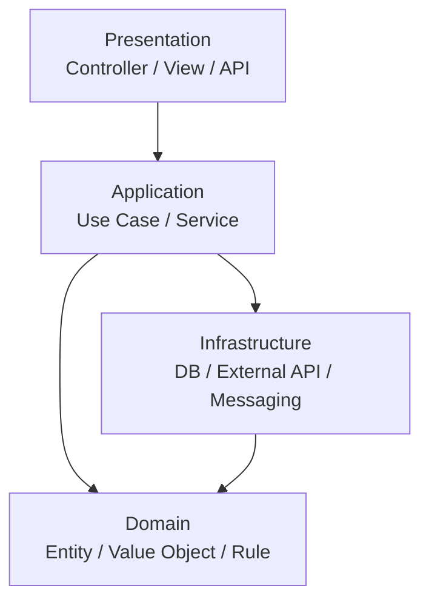

# レイヤードアーキテクチャ

## 概要

レイヤードアーキテクチャは、アプリケーションを責務ごとの層に分け、上位層から下位層へ処理を流す基本的な構成です。典型的には Presentation、Application、Domain、Infrastructure、Data Access のような層に分けます。大事なのは「物理的にサーバーを分けること」ではなく、「関心ごとを論理的に分けること」です。

## 解決したい課題

- UI、業務ロジック、永続化処理が混ざって変更しづらくなる問題を避ける
- どこに何を書くべきかをチームで共有しやすくする
- 影響範囲を層単位で把握し、レビューやテストの焦点を絞る
- 小規模から中規模の業務アプリケーションで、過度に複雑な設計を避ける

## 背景・登場した文脈

業務アプリケーションでは、画面表示、入力検証、業務ルール、DBアクセスが一つの処理にまとまりがちです。これを整理するため、古くから Presentation / Domain / Data Source のような分離が使われてきました。Martin Fowlerは、情報量の多いアプリケーションをUI、ドメインロジック、データアクセスの3つに分ける考え方を説明しています。

## 基本構成

| 層 | 責務 |
| --- | --- |
| Presentation | HTTP、画面、CLIなどの入力受付と出力整形 |
| Application | ユースケースの進行、トランザクション境界、認可などの調整 |
| Domain | 業務ルール、エンティティ、値オブジェクト、ドメインサービス |
| Infrastructure | DB、外部API、メッセージング、ファイルなどの技術詳細 |

## 依存関係の考え方

素朴なレイヤードアーキテクチャでは、依存は上から下へ流れます。PresentationはApplicationに依存し、ApplicationはDomainやInfrastructureに依存します。ただし、DomainがInfrastructureに直接依存するとDBや外部APIの都合が業務ルールに入り込みやすいため、Repository interfaceやMapperで依存を反転することがあります。この反転を強く徹底すると、ヘキサゴナル、オニオン、クリーンアーキテクチャに近づきます。

## Mermaid図



この図は典型的な依存方向を示しています。実務では、DomainをInfrastructureから独立させるために、ApplicationまたはDomain側にインターフェースを置くことがあります。

## ディレクトリ構成例

```text
src/
├── presentation/
│   └── order-controller.md
├── application/
│   └── place-order-use-case.md
├── domain/
│   ├── order.md
│   └── money.md
└── infrastructure/
    ├── order-repository.md
    └── payment-client.md
```

## 向いている場面

- CRUD中心、または業務ルールが中程度のアプリケーション
- チームで責務の置き場所を揃えたい場合
- フレームワーク標準構成に乗りながら設計を整理したい場合
- 最初から過度な抽象化を避けたい場合

## 向いていない場面

- ドメインごとの独立性やチーム境界を強く表現したい大規模システム
- DBや外部APIを差し替える可能性が高く、依存反転を徹底したい場合
- レイヤー単位の分割が肥大化し、変更が常に複数層にまたがる場合

## メリット

- 理解しやすく、導入しやすい
- 責務の置き場所を説明しやすい
- フレームワークの一般的な構成と相性がよい
- 小さく始めて、必要に応じて依存反転を追加できる

## デメリット

- 下位層への依存が強くなり、DomainがInfrastructureに引きずられやすい
- レイヤー別チームにすると、機能開発が多くのチームを横断しやすい
- レイヤーごとのディレクトリが肥大化すると、業務単位のまとまりが見えにくくなる
- 単純なCRUDでも過剰な層を作ると、読むファイルが増えるだけになる

## よくある誤解

- レイヤーは物理サーバーやデプロイ単位ではない。多くの場合は論理的な責務分離である。
- Presentation、Application、Domain、Infrastructureという名前は固定ではない。重要なのは責務の分離である。
- レイヤードだからDomainが必ずDBに依存してよい、という意味ではない。
- 層を増やせば保守性が上がるわけではない。分離する理由が必要。

## 類似アーキテクチャとの違い

| 比較対象 | 違い |
| --- | --- |
| クリーンアーキテクチャ | レイヤードは上から下への依存が基本。クリーンは内側への依存をルールとして徹底する |
| ヘキサゴナルアーキテクチャ | レイヤードは上下の層で考える。ヘキサゴナルは内外の境界とPort/Adapterで考える |
| オニオンアーキテクチャ | オニオンはDomainを中心に置き、依存を中心へ向ける点を強調する |
| Vertical Slice Architecture | レイヤー単位ではなく、機能単位で縦に分割する |

## 実務での判断ポイント

- まずは業務ロジックがPresentationやInfrastructureに漏れていないかを見る
- DomainがDBテーブル構造に強く引っ張られているなら、RepositoryやMapperで分離を検討する
- レイヤー単位のディレクトリが大きくなったら、ドメインや機能単位のモジュール分割を検討する
- レイヤーを増やす前に、その層が何を守るために存在するのかを言語化する

## 参考

- Martin Fowler, [Presentation Domain Data Layering](https://martinfowler.com/bliki/PresentationDomainDataLayering.html)
- Martin Fowler, *Patterns of Enterprise Application Architecture*, Addison-Wesley, 2002
