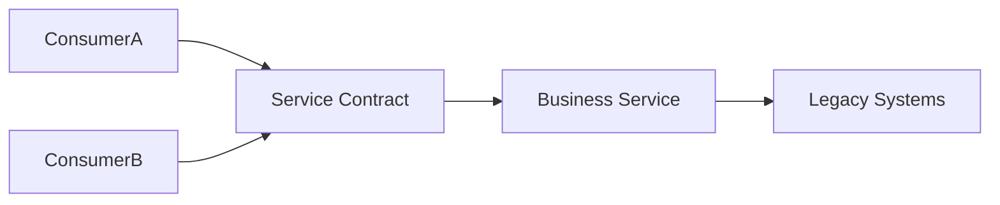

# SOA

## 概要

業務機能をサービスとして提供し、契約を通じてシステムを連携する設計です。

## 解決したい課題

- 企業内の複数システムが個別連携し、業務機能の再利用や契約管理が難しい
- 共通機能がシステムごとに重複し、変更時の整合性が取りにくい
- サービスの粒度、所有者、契約が曖昧で、利用側が内部仕様に依存している

## 背景・登場した文脈

SOAは、業務能力をサービスとして公開し、契約に基づいてシステムを連携する考え方です。WebサービスやESBとともに企業システム統合で広まりました。中心は技術ではなく、サービス境界、契約、再利用、ガバナンスです。

## 基本構成

| 要素 | 責務 |
| --- | --- |
| Service | 独立した業務機能や実行単位 |
| Service Contract | 操作、データ形式、非機能要件の契約 |
| Service Registry | 利用可能なサービスを発見・管理する仕組み |
| Integration Bus | 複数システム間の連携を仲介する基盤 |

## Mermaid図

この図は、SOAで中心になる責務と流れを簡略化したものです。実際の設計では、組織体制、運用能力、既存システムとの接続、非機能要件によって境界の切り方が変わります。

## 向いている場面

- 複数システムで共通業務機能を契約として再利用したい
- 企業内連携の標準、バージョニング、所有者を整えたい
- 既存システムを段階的にサービス化したい

## 向いていない場面

- 小さなチーム内アプリで、サービス契約の運用が過剰
- 再利用を目的に巨大な汎用サービスを作ろうとしている
- 契約変更や廃止のガバナンスを運用できない

## メリット

- 業務機能をサービス契約として説明しやすい
- 共通機能の重複を減らせる場合がある
- 企業内の連携標準や統制を整えやすい

## デメリット

- サービス粒度を誤ると巨大サービスや過剰に細かい連携になる
- ガバナンスが重すぎると変更速度が落ちる
- ESBなど基盤に業務ロジックが集中しやすい

## よくある誤解

- SOAはESBを導入することではない。サービス契約、再利用、ガバナンスをどう設計するかが中心。
- サービスを大きく切れば再利用しやすいとは限らない。粒度が粗すぎると変更理由が混ざる。
- マイクロサービスの古い呼び名ではない。SOAは企業機能の統合と契約管理を重視する傾向がある。

## 失敗しやすいポイント

- サービス契約が曖昧で、利用側が内部仕様に依存する
- 再利用を重視しすぎて、汎用サービスが巨大化する
- ガバナンスが承認プロセスだけになり、変更速度を落とす

## 類似アーキテクチャとの違い

| 比較対象 | 違い |
|---|---|
| マイクロサービス | マイクロサービスは小さな独立サービスと分散デプロイを重視する。SOAは企業機能をサービス契約として公開し、再利用と統合を重視する傾向が強い |
| ESB | ESBはSOAを支える統合基盤の一形態。SOAの価値はサービス境界、契約、ガバナンスにあり、ESBの有無だけではSOAとは言えない |
| API Gateway | API GatewayはAPI入口の制御に焦点を当てる。SOAは業務サービス全体の契約、粒度、再利用方針を扱う |

## 実務での判断ポイント

- サービスを業務能力単位で定義し、所有者と契約を明確にする
- 同期API、非同期メッセージ、ESB利用の使い分けを決める
- 契約変更、バージョニング、廃止手順を整備する
- 再利用性と自律性のバランスを組織構造に合わせる

## 導入チェックリスト

- [ ] 各サービスに業務責任、所有者、契約がある
- [ ] サービス契約の変更とバージョニング手順がある
- [ ] サービス利用状況と障害影響を追跡できる
- [ ] ESBやAPI Gatewayに業務ルールを集めすぎていない

## 参考

- OASIS, [Reference Model for Service Oriented Architecture 1.0](https://docs.oasis-open.org/soa-rm/v1.0/soa-rm.html)
