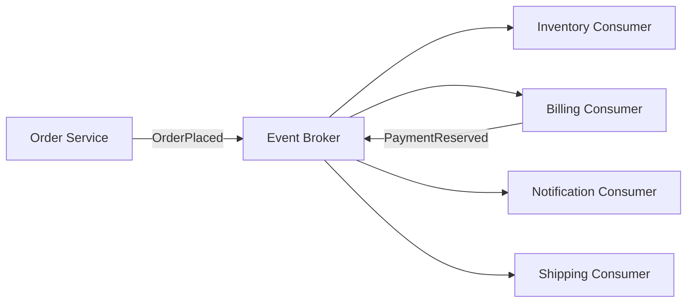

# イベント駆動アーキテクチャ

## 概要

イベント駆動アーキテクチャは、状態変化や業務上の出来事をイベントとして発行し、購読側が非同期に反応する構成です。発行側は「何が起きたか」を伝え、購読側はそれに応じて必要な処理を行うため、システム間の直接依存を減らしやすくなります。

## 解決したい課題

- 1つの出来事に複数の後続処理を接続したい
- サービス同士の同期呼び出し連鎖を減らしたい
- 後から処理を追加しても、発行側を変更しなくてよい構造にしたい
- 高負荷処理や外部連携を非同期にして、応答時間や障害波及を抑えたい

## 基本構成

| 要素 | 責務 |
| --- | --- |
| Event Producer | 業務上の出来事をイベントとして発行する |
| Event Broker | イベントの配送、保持、ルーティング、再配信を担う |
| Event Consumer | イベントを購読し、自分の責務に応じて処理する |
| Event Schema | イベント名、意味、データ形式、互換性を定義する |
| Dead Letter / Retry | 処理失敗時の隔離、再試行、再処理を担う |

## Mermaid図

この図では、注文作成イベントを複数のConsumerが購読しています。発行側は通知、請求、在庫の具体的な処理を直接呼ばないため、後続処理を追加しやすくなります。

## 向いている場面

- 1つの出来事に複数システムが反応する
- 後続処理を非同期化して応答時間を短くしたい
- 新しい購読者を追加しながら機能拡張したい
- 最終的整合性を業務上許容できる
- イベントの重複、順序、再試行を設計できる

## 向いていない場面

- 即時の強整合性が必要で、処理完了を同期的に保証したい
- イベントの意味やスキーマを管理する体制がない
- Consumerの失敗、重複処理、順序ずれに対応できない
- 処理の流れが見えなくなると運用上困る
- 単純な同期呼び出しで十分な小規模処理

## メリット

- 発行側と購読側を疎結合にできる
- 後続処理を追加しやすい
- 負荷の平準化や一時的な障害吸収に向く
- サービス間の直接同期呼び出しを減らせる

## デメリット

- 処理の全体像を追いにくくなる
- 重複、順序、遅延、再試行、冪等性の設計が必要
- イベントスキーマの変更が難しい
- 一時的な不整合を利用者や運用が理解する必要がある

## 類似アーキテクチャとの違い

| 比較対象 | 違い |
| --- | --- |
| Publish-Subscribe | Publish-Subscribeは通信パターン。イベント駆動アーキテクチャは業務上の出来事を中心にシステムを構成する考え方 |
| Event Sourcing | Event Sourcingはイベントを状態の源泉として永続化する方式。イベント駆動は連携や処理起動にイベントを使う構成も含む |
| Message Queue Architecture | Message Queueは配送手段。イベント駆動は「何が起きたか」を契約として扱う設計方針 |
| Sagaパターン | Sagaは分散更新の業務プロセス管理。Choreography型Sagaはイベント駆動で実装されることが多い |

## 実務での判断ポイント

- イベント名は `OrderPlaced` のように過去形の業務事実として表す
- イベントに現在状態のスナップショットを入れるのか、IDだけを入れるのかを決める
- Consumerは冪等にし、同じイベントを複数回受けても破綻しないようにする
- Event Schemaのバージョニングと後方互換性を管理する
- イベントが増えたら、イベントカタログやトレースで流れを可視化する
- 失敗イベント、Dead Letter Queue、再処理手順を運用設計に含める

## 参考

- Martin Fowler, [What do you mean by “Event-Driven”?](https://martinfowler.com/articles/201701-event-driven.html)
- Gregor Hohpe, Bobby Woolf, *Enterprise Integration Patterns*, Addison-Wesley, 2003
- Martin Kleppmann, *Designing Data-Intensive Applications*, O'Reilly, 2017
