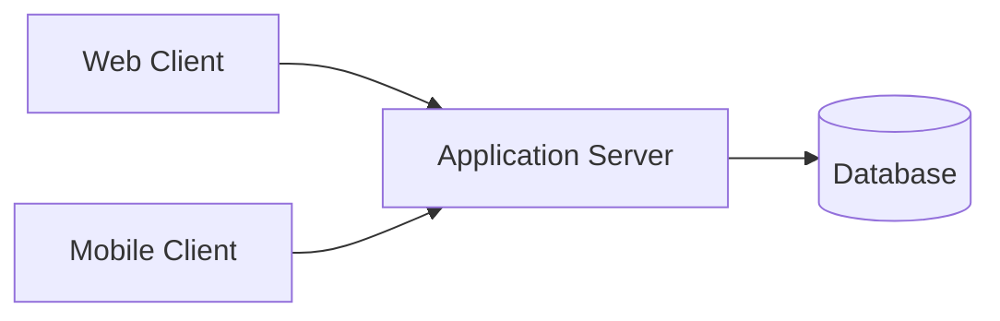

# Client-Server Architecture

## 概要

クライアントとサーバーに責務を分けて通信する基本構成です。

## 解決したい課題

- 複数クライアントから共通データや共通機能を使いたい
- クライアント側にすべての処理やデータを持たせると更新、保護、共有が難しい
- UIとサーバー側の状態管理、認証、業務処理を分けたい

## 背景・登場した文脈

Client-Server Architectureは、クライアントが要求を送り、サーバーが機能やデータを提供する基本構成です。Web、業務アプリ、モバイルアプリなど多くのシステムの土台です。単純に見えますが、認証、セッション、ネットワーク失敗、API契約をどう扱うかが品質を左右します。

## 基本構成

| 要素 | 責務 |
| --- | --- |
| Client | 要求を送る利用者側またはアプリケーション |
| Server | 要求を受けて処理やデータを提供する側 |
| Protocol | 通信の形式、手順、エラー表現の規約 |
| Shared Resource | 複数クライアントが利用するデータや機能 |

## Mermaid図

この図は、Client-Server Architectureで中心になる責務と流れを簡略化したものです。実際の設計では、組織体制、運用能力、既存システムとの接続、非機能要件によって境界の切り方が変わります。

## 向いている場面

- 複数のクライアントが同じサーバー機能を利用する
- データや認証を中央で管理したい
- クライアント配布後もサーバー側で処理を更新したい

## 向いていない場面

- 中央サーバーに依存できないオフライン中心の用途
- ノード同士が対等に資源を共有するP2P用途
- サーバー運用やスケールを担う体制がない

## メリット

- データと認証をサーバー側で統制しやすい
- 複数クライアントから共通機能を利用しやすい
- サーバー側の更新で機能改善や不具合修正を反映しやすい

## デメリット

- サーバーがボトルネックや単一障害点になりやすい
- ネットワーク遅延や障害が利用者体験に直結する
- API互換性やクライアントバージョン差を管理する必要がある

## よくある誤解

- 単純な2層構成に見えても、認証、状態管理、キャッシュ、ネットワーク障害の扱いが必要。
- サーバーに集約すれば常に安全とは限らない。単一障害点やスケール限界を設計する。
- クライアントは表示だけとは限らない。オフライン対応や入力検証など、どこまで持つか判断が必要。

## 失敗しやすいポイント

- サーバーAPIが画面都合に引きずられ、複数クライアントで使い回しにくくなる
- セッション状態をサーバーに強く持ち、水平スケールや切り戻しが難しくなる
- ネットワーク遅延や失敗をUIで扱わず、利用者体験が悪化する

## 類似アーキテクチャとの違い

| 比較対象 | 違い |
|---|---|
| Three-Tier Architecture | Three-TierはUI、業務ロジック、データを3層に分ける。Client-Serverはクライアントとサーバーの通信関係を表す、より基本的な構成 |
| Peer-to-Peer Architecture | P2Pは各ノードが対等に通信し、中央サーバー依存を小さくする。Client-Serverはサーバーが提供側、クライアントが利用側という役割分担を置く |
| BFF | BFFはクライアント種別ごとの専用バックエンドを置く。Client-Serverはその前提になる通信モデルであり、BFFほどAPI整形責務を明確にしない |

## 実務での判断ポイント

- 処理をクライアントとサーバーのどちらに置くか、セキュリティとUXで判断する
- ステートレスにする範囲とセッション管理方法を決める
- API契約、認証方式、エラー表現を先に定義する
- キャッシュ、リトライ、オフライン時の挙動を設計する

## 導入チェックリスト

- [ ] クライアントとサーバーの責務分担が明確である
- [ ] API契約、認証、エラー形式が定義されている
- [ ] サーバーの水平スケールとセッション管理の方針がある
- [ ] ネットワーク失敗時のUIと再試行方針がある

## 参考

- Andrew S. Tanenbaum, Maarten van Steen, *Distributed Systems*, 3rd Edition, 2017
