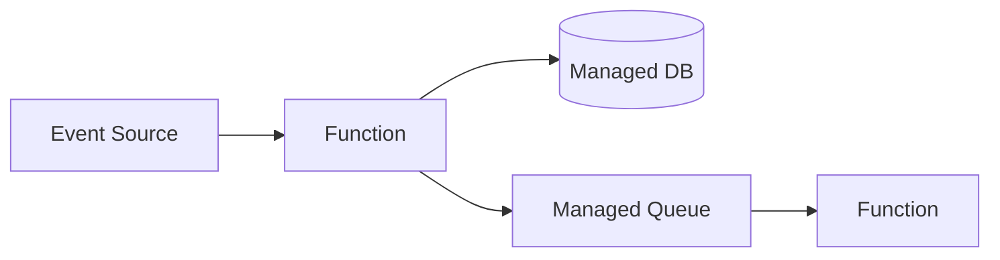

# サーバーレスアーキテクチャ

## 概要

サーバー管理をクラウドへ委ね、関数とマネージドサービスで構成する設計です。

## 解決したい課題

- サーバーの構築、パッチ適用、スケール調整などの運用負荷を下げたい
- イベント単位の処理や小さなAPIを利用量に応じて実行したい
- ピークが読みにくい処理で、常時稼働リソースを持ちたくない

## 背景・登場した文脈

サーバーレスアーキテクチャは、関数実行基盤やマネージドサービスを組み合わせ、サーバー管理の多くをクラウド事業者へ委ねる構成です。FaaS、マネージドQueue、DB、認証などと相性がよく、イベント駆動で使われることが多いです。ただし、権限、監視、コールドスタート、コストは設計対象として残ります。

## 基本構成

| 要素 | 責務 |
| --- | --- |
| Function | イベントに応じて起動する小さな処理単位 |
| Event Source | 関数や処理を起動するイベント発生元 |
| Managed Service | クラウド事業者が運用を担うDB、キュー、認証など |
| IAM / Policy | 権限、認可、実行ポリシーを制御する仕組み |

## Mermaid図

この図では、HTTPやイベントをトリガーに関数が実行され、マネージドサービスと連携する構成を示しています。サーバー管理は減りますが、権限、再試行、DLQ、コスト監視は利用側の責任として残ります。

## 向いている場面

- イベント駆動の処理や小さなAPIを素早く構築したい
- 利用量の変動が大きく、スケールを自動化したい
- インフラ運用より業務処理に集中したい

## 向いていない場面

- 長時間実行や低レイテンシが厳しい処理が中心
- クラウド固有サービスへの依存を避けたい
- 分散した関数群の監視や権限管理を運用できない

## メリット

- サーバー管理やスケール調整の負荷を下げやすい
- 利用量に応じた課金と自動スケールを活かせる
- マネージドサービスと組み合わせて短期間で構築しやすい

## デメリット

- クラウド固有の制約やロックインが強くなりやすい
- 関数が増えると依存関係と監視が複雑になる
- コールドスタート、同時実行制限、外部接続数を考慮する必要がある

## よくある誤解

- サーバーレスでもサーバーは存在する。運用責任がクラウド側へ移る範囲と、利用者側に残る責任を理解する。
- 関数を細かく分ければ良いわけではない。起動遅延、監視、権限、デプロイ単位が増える。
- 常に安いとは限らない。高頻度処理、長時間処理、データ転送料ではコンテナより高くなる場合がある。

## 失敗しやすいポイント

- 関数間の非同期連携が増え、エラー追跡と再実行が難しくなる
- IAM権限を広く付けすぎ、関数ごとの最小権限が崩れる
- コールドスタートや外部接続数を見積もらず、レイテンシが安定しない

## 類似アーキテクチャとの違い

| 比較対象 | 違い |
|---|---|
| マイクロサービス | マイクロサービスはサービス境界と独立デプロイを重視する。サーバーレスは関数やマネージドサービスを使い、サーバー運用責任を小さくする実行方式に焦点がある |
| イベント駆動アーキテクチャ | イベント駆動はイベントによる連携方式。サーバーレスではイベント駆動がよく使われるが、HTTP関数やバッチ関数などイベント以外の入口もあり得る |
| コンテナベースアーキテクチャ | コンテナベースは実行環境をイメージとして管理する。サーバーレスは起動、スケール、パッチ適用などをクラウド側に委ねる範囲が大きい |

## 実務での判断ポイント

- イベント駆動、HTTP API、バッチなど処理入口ごとの適性を確認する
- 関数の粒度、タイムアウト、リトライ、DLQを設計する
- 最小権限、秘密情報、監査ログを関数単位で管理する
- 実行回数、実行時間、データ転送料をコスト試算に含める

## 導入チェックリスト

- [ ] 関数ごとのトリガー、責務、タイムアウトが定義されている
- [ ] リトライ、DLQ、冪等性、補償処理が設計されている
- [ ] IAM権限が最小化され、秘密情報管理がある
- [ ] コールドスタート、同時実行数、コストを測定している

## 参考

- AWS, [Serverless Applications Lens](https://docs.aws.amazon.com/wellarchitected/latest/serverless-applications-lens/welcome.html)
