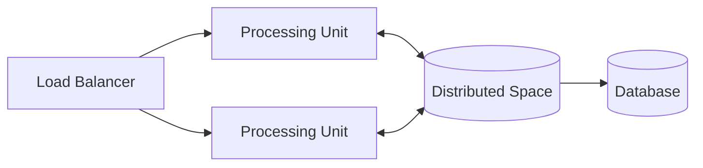

# Space-Based Architecture

## 概要

分散キャッシュや共有スペースを中心に水平スケールする構成です。

## 解決したい課題

- DBや中央状態管理に負荷が集中し、高トラフィックでスケールしにくい
- 処理ノードを増やしても共有状態へのアクセスがボトルネックになる
- セッションや一時状態を分散し、処理を水平展開したい

## 背景・登場した文脈

Space-Based Architectureは、分散キャッシュやインメモリデータグリッドのような共有スペースを中心に、処理ノードを水平スケールさせる構成です。高トラフィックや一時的な状態処理に向きますが、整合性、失効、分散障害を設計できることが前提です。

## 基本構成

| 要素 | 責務 |
| --- | --- |
| Processing Unit | 水平スケール可能な処理単位 |
| Distributed Space | 複数ノードで共有するメモリ上のデータ空間 |
| Virtualized Middleware | 分散キャッシュやメッセージングなどの基盤 |
| Async Persistence | 共有スペースの状態を非同期に永続化する仕組み |

## Mermaid図

この図は、Space-Based Architectureで中心になる責務と流れを簡略化したものです。実際の設計では、組織体制、運用能力、既存システムとの接続、非機能要件によって境界の切り方が変わります。

## 向いている場面

- 読み書き負荷が高く、DBへの集中を避けたい
- 一時状態やセッションを複数ノードで共有したい
- 強整合よりスループットや可用性を重視する

## 向いていない場面

- 金融取引のように強整合と監査性が最優先
- 共有スペースの障害復旧やデータ整合性を運用できない
- 単純なDBスケールやキャッシュで十分

## メリット

- 処理ノードを増やして負荷を分散しやすい
- DBへの直接アクセスを減らし、ピーク負荷を吸収しやすい
- 一時状態を共有しながら水平スケールしやすい

## デメリット

- キャッシュと正本データの整合性管理が難しい
- ホットキーやデータ偏りで一部ノードに負荷が集中する
- 共有スペース障害時の影響が大きい

## よくある誤解

- 分散キャッシュを入れればSpace-Basedになるわけではない。共有スペースを中心に処理ノードをスケールさせる設計が必要。
- DB負荷を隠すためだけに使うと整合性問題が残る。データの所有、更新、失効を決める。
- 高スループット向けの構成であり、強整合や複雑なトランザクションには向かない場合がある。

## 失敗しやすいポイント

- キャッシュとDBの整合性が崩れ、どちらが正しい状態か分からなくなる
- スペース障害時の縮退や復旧手順がなく、全処理が止まる
- データ分割やホットキー対策をせず、一部ノードに負荷が集中する

## 類似アーキテクチャとの違い

| 比較対象 | 違い |
|---|---|
| マイクロサービス | マイクロサービスはサービス境界と独立デプロイを重視する。Space-Basedは共有スペースや分散キャッシュで状態アクセスを分散し、負荷集中を避けることを重視する |
| イベント駆動アーキテクチャ | イベント駆動はイベント通知で疎結合にする。Space-Basedはデータグリッドや共有スペースを中心に、処理ノードが状態を読み書きする構成を取る |
| キャッシュ戦略 | キャッシュ戦略は性能改善の局所的手段になりやすい。Space-Basedはキャッシュを中核に据え、アプリケーション全体のスケール設計として扱う |

## 実務での判断ポイント

- 負荷集中の原因がDB、セッション、計算処理のどこにあるか確認する
- 共有スペースに置くデータ、保持期間、整合性モデルを決める
- ホットデータの分散、再配置、失効戦略を設計する
- 強整合が必要な処理を別経路に分ける

## 導入チェックリスト

- [ ] 共有スペースに置くデータと正本データの関係が明確である
- [ ] 失効、更新、再構築、障害復旧の手順がある
- [ ] ホットキーや偏りを監視できる
- [ ] 強整合が必要なユースケースを分離している

## 参考

- Mark Richards, Neal Ford, *Fundamentals of Software Architecture*, O'Reilly, 2020
