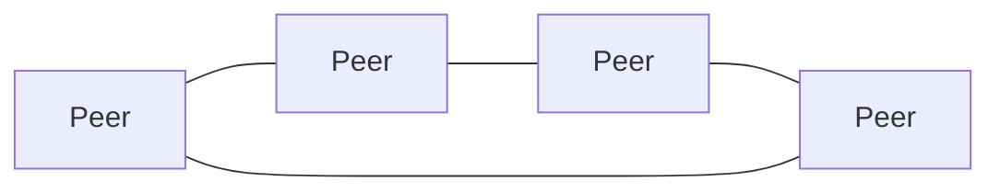

# Peer-to-Peer Architecture

## 概要

中央サーバーに依存せず、ノード同士が対等に通信する構成です。

## 解決したい課題

- 中央サーバーへの依存や単一障害点を減らしたい
- 参加ノードのストレージ、帯域、計算資源を活用したい
- 中央管理者なしでデータや機能を共有したい

## 背景・登場した文脈

Peer-to-Peer Architectureは、ノード同士が対等に通信し、提供者にも利用者にもなる構成です。ファイル共有、ブロックチェーン、分散台帳、分散ストレージなどで使われます。中央依存を下げられる一方、ノード発見、信頼、整合性、悪意ある参加者への対策が難しくなります。

## 基本構成

| 要素 | 責務 |
| --- | --- |
| Peer | 要求側と提供側の両方の役割を持つノード |
| Overlay Network | 物理ネットワーク上に作る論理的な接続関係 |
| Discovery | 他ノードや宛先を見つける仕組み |
| Replication | データや処理を複数ノードへ複製する仕組み |

## Mermaid図

この図は、Peer-to-Peer Architectureで中心になる責務と流れを簡略化したものです。実際の設計では、組織体制、運用能力、既存システムとの接続、非機能要件によって境界の切り方が変わります。

## 向いている場面

- 中央サーバーの障害や統制に依存したくない
- 多数の参加ノードの資源を活用したい
- 分散台帳や分散ストレージのように対等性が価値になる

## 向いていない場面

- 強い中央統制、即時整合、単純な監査が必要
- 参加ノードを信頼できず、対策コストを負えない
- 接続性やNAT越えなどネットワーク制約が大きい

## メリット

- 中央サーバー依存と単一障害点を減らせる
- 参加ノードの資源を横に広げて使える
- 特定組織に依存しない共有モデルを作りやすい

## デメリット

- ノード発見、NAT越え、接続維持が難しい
- 不正ノード、改ざん、Sybil攻撃への対策が必要
- データの一貫性や削除要求への対応が複雑になる

## よくある誤解

- P2Pは中央サーバーが一切不要という意味ではない。探索、認証、ブートストラップに補助サーバーを使う場合がある。
- ノードが対等でも信頼できるとは限らない。なりすまし、改ざん、悪意あるノードへの対策が必要。
- 可用性は上がり得るが、データ探索、整合性、更新伝播の難しさも増える。

## 失敗しやすいポイント

- ノード発見やNAT越えを軽視し、実環境で接続できない
- 信頼モデルを決めず、不正データやSybil攻撃に弱くなる
- データの複製数や保持責任が曖昧で、必要な時に取得できない

## 類似アーキテクチャとの違い

| 比較対象 | 違い |
|---|---|
| Client-Server Architecture | Client-Serverはサーバーが中心に機能やデータを提供する。P2Pは各ノードが提供者にも利用者にもなり、中央依存を下げる |
| Broker Architecture | Brokerは仲介者を通して通信相手やルーティングを抽象化する。P2Pはノード同士が直接または分散的な探索で接続する |
| 分散システム | 分散システムは複数ノードで構成される広い概念。P2Pはその中でもノードの対等性と中央集権の少なさを重視する形 |

## 実務での判断ポイント

- 中央集権を避けたい理由が可用性、検閲耐性、コスト分散のどれかを明確にする
- ノード発見、認証、暗号化、信頼評価を設計する
- データ複製、整合性、削除要求への対応を決める
- 運用監視を中央でどこまで行うか決める

## 導入チェックリスト

- [ ] ノード発見と接続確立の方式が決まっている
- [ ] ノード認証、暗号化、不正対策がある
- [ ] データ複製、保持、削除のルールがある
- [ ] ネットワーク分断や悪意あるノードを想定したテストがある

## 参考

- Andrew S. Tanenbaum, Maarten van Steen, *Distributed Systems*, 3rd Edition, 2017
