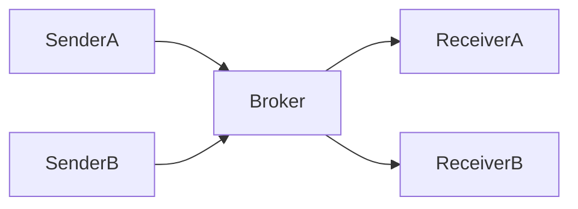

# Broker Architecture

## 概要

仲介役のBrokerを介してコンポーネント間を接続する構成です。

## 解決したい課題

- 送信側が受信側の場所、プロトコル、実装詳細を直接知っている
- 宛先解決、ルーティング、負荷分散、変換が各コンポーネントに重複している
- 通信相手の追加や変更が送信側の変更に直結する

## 背景・登場した文脈

Broker Architectureは、ClientやSenderがBrokerを介してReceiverやServiceへ接続する構成です。分散オブジェクト、メッセージング、API仲介など幅広い形があります。Brokerに何を任せるかで利点もリスクも変わるため、単なる中継役ではなく通信契約の中心として設計します。

## 基本構成

| 要素 | 責務 |
| --- | --- |
| Client / Sender | 要求やメッセージを送る側 |
| Broker | 宛先解決、転送、仲介を担うコンポーネント |
| Server / Receiver | 要求やメッセージを受けて処理する側 |
| Contract | 呼び出しやメッセージの形式と意味の契約 |

## Mermaid図

この図では、SenderがBrokerを介してReceiverへ要求やメッセージを届ける構成を示しています。Brokerに任せる責務を、宛先解決、変換、ルーティングのどこまでにするかで複雑さが変わります。

## 向いている場面

- 送信側と受信側の直接依存を減らしたい
- 宛先解決、ルーティング、変換、負荷分散を仲介したい
- サービスの場所や実装を利用側から隠したい

## 向いていない場面

- 通信が単純で、直接呼び出しの方が透明性が高い
- Brokerを高可用に運用する体制がない
- 低レイテンシでBroker経由のオーバーヘッドを許容できない

## メリット

- 通信相手の変更をBrokerで吸収しやすい
- ルーティングや変換を共通化しやすい
- 利用側からサービスの場所や実装を隠蔽できる

## デメリット

- Brokerが単一障害点や性能ボトルネックになりやすい
- Brokerに業務判断が集まると変更が集中する
- メッセージ契約やルーティング規約の管理が必要になる

## よくある誤解

- Brokerを置けば疎結合になるわけではない。メッセージ契約やルーティング規約で結合は残る。
- Brokerは単なる中継ではない。探索、ルーティング、変換、負荷分散など、どの責務を持たせるかで性質が変わる。
- Brokerが便利になるほど単一障害点や性能ボトルネックになりやすい。

## 失敗しやすいポイント

- Brokerに業務判断を入れすぎ、変更が集中する
- メッセージスキーマやルーティングキーの変更管理がなく、利用側が壊れる
- Broker障害時の再送、滞留、迂回を設計しない

## 類似アーキテクチャとの違い

| 比較対象 | 違い |
|---|---|
| Publish-Subscribe | Publish-SubscribeはTopicを介した多対多のイベント配信に焦点がある。Broker Architectureは宛先解決、ルーティング、変換など仲介役全般を含む |
| Message Queue Architecture | Message QueueはQueueによる非同期処理と負荷平準化に焦点がある。Broker Architectureは同期・非同期を問わず、通信相手を仲介する構成として使われる |
| API Gateway Pattern | API Gatewayは主に外部クライアントから内部APIへの入口を統制する。Broker Architectureは内部コンポーネント間の仲介にも使われ、入口制御に限定されない |

## 実務での判断ポイント

- Brokerの責務をルーティング、変換、探索、負荷分散のどこまでにするか決める
- 通信を同期にするか非同期にするか、失敗時の扱いを含めて選ぶ
- Broker自体の可用性、スケール、監視を設計する
- クライアントとサービス間の契約をBroker越しでも明文化する

## 導入チェックリスト

- [ ] Brokerに置く責務と置かない業務判断が明確である
- [ ] メッセージ契約とルーティング規約がある
- [ ] Broker障害時の再送、滞留、迂回手順がある
- [ ] Brokerの遅延、エラー、キュー長を監視している

## 参考

- Frank Buschmann et al., *Pattern-Oriented Software Architecture Volume 1*, Wiley, 1996
