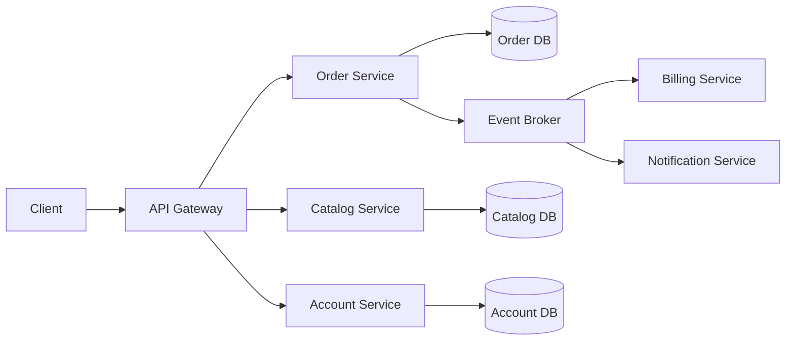

# マイクロサービスアーキテクチャ

## 概要

マイクロサービスアーキテクチャは、システムを小さな独立サービスに分け、それぞれを独立して開発、デプロイ、運用する構成です。単にAPIを細かく分けることではなく、業務能力、データ所有権、チームの責任範囲、運用体制を含めて境界を設計します。

## 解決したい課題

- 巨大なアプリケーションの変更影響をサービス単位に閉じ込める
- 複数チームが独立して開発、テスト、リリースできるようにする
- 機能ごとにスケール、可用性、技術選択を変えられるようにする
- 一部サービスの障害が全体へ波及しにくい構成にする

## 基本構成

| 要素 | 責務 |
| --- | --- |
| Service | 特定の業務能力を提供し、独立してデプロイされる単位 |
| API / Messaging | サービス間の同期・非同期連携の契約 |
| Owned Data | サービスが自身で所有し、直接外部から書き換えさせないデータ |
| Deployment Pipeline | サービスごとのビルド、テスト、リリースを自動化する |
| Observability | ログ、メトリクス、分散トレースでサービス間の状態を追跡する |

## Mermaid図

この図では、各サービスが自分のDBを所有し、必要に応じてAPI GatewayやEvent Brokerを介して連携します。DBを共有して直接テーブルを読み書きすると、サービス分割しても実質的には密結合のままになります。

## 向いている場面

- 複数チームが別々のサービスを所有し、独立してリリースしたい
- 一部機能だけスケールや可用性の要求が大きく異なる
- ドメイン境界やデータ所有権がある程度見えている
- CI/CD、監視、ログ、分散トレース、オンコール体制を整えられる
- サービスごとに技術選択や運用責任を分ける価値がある

## 向いていない場面

- 初期プロダクトで機能境界がまだ大きく変わる
- チームが小さく、複数サービスの運用負荷を持てない
- サービス間で強い整合性トランザクションが頻繁に必要
- 監視や障害対応の基盤が弱い
- 分割理由が「流行っているから」だけで、独立性の価値が説明できない

## メリット

- サービスごとに独立デプロイしやすい
- チームの所有権と責任範囲を明確にしやすい
- 機能ごとにスケールや技術選択を変えられる
- 障害や変更の影響範囲をサービス単位に抑えやすい

## デメリット

- 分散システムとしての監視、デバッグ、テストが難しくなる
- サービス間通信の遅延、失敗、リトライ、タイムアウトを設計する必要がある
- データ整合性が最終的整合性になりやすい
- サービス境界を誤ると、分散モノリスになる
- API契約、バージョニング、認証認可、デプロイ調整のコストが増える

## 類似アーキテクチャとの違い

| 比較対象 | 違い |
| --- | --- |
| モジュラーモノリス | モジュラーモノリスは単一デプロイ内で境界を作る。マイクロサービスは境界をデプロイ、データ、運用責任まで広げる |
| SOA | SOAは企業内の共有サービスや統合基盤を重視することが多い。マイクロサービスは小さな自律サービスと独立デプロイを重視する |
| サーバーレスアーキテクチャ | サーバーレスは実行基盤管理をクラウドへ委譲する。マイクロサービスはサービス境界とチーム自律性の設計が中心 |
| イベント駆動アーキテクチャ | イベント駆動は連携方式。マイクロサービスで非同期連携を実現するために組み合わせることが多い |

## 実務での判断ポイント

- サービス境界はテーブルや画面ではなく、業務能力と変更理由から決める
- サービスごとにDB所有権を明確にし、直接共有DBアクセスを避ける
- 同期呼び出しの連鎖を増やしすぎない
- 分散トレース、契約テスト、APIバージョニングを初期から用意する
- いきなり全面移行せず、モジュラーモノリスやStrangler Fig Patternで段階的に切り出す

## 参考

- James Lewis, Martin Fowler, [Microservices](https://martinfowler.com/articles/microservices.html), 2014
- Sam Newman, *Building Microservices*, 2nd Edition, O'Reilly, 2021
- Chris Richardson, [Pattern: Microservice Architecture](https://microservices.io/patterns/microservices.html)
