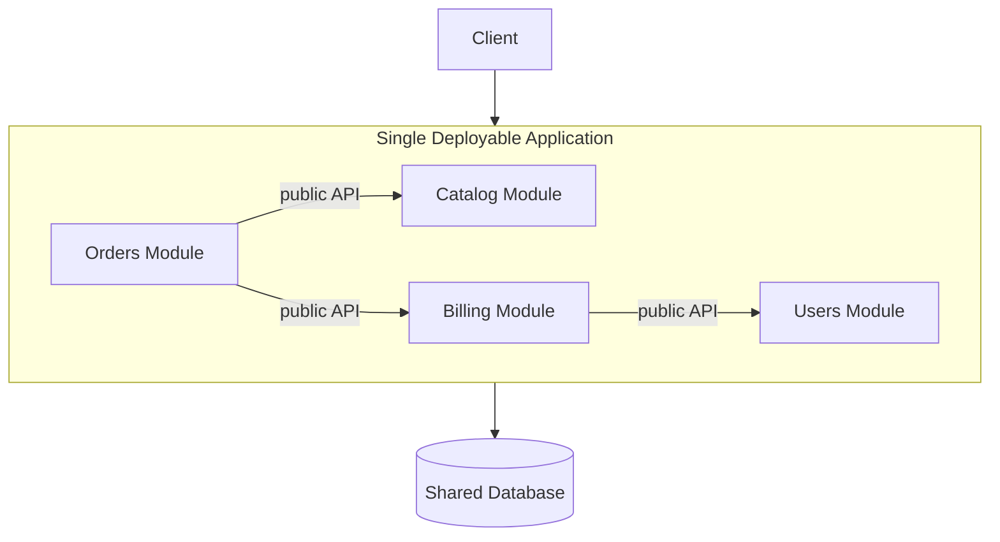

# モジュラーモノリス

## 概要

モジュラーモノリスは、デプロイ単位は1つに保ちながら、内部を明確なモジュール境界で分割する構成です。マイクロサービスのように業務境界や所有権を意識しつつ、ネットワーク分散、分散トランザクション、複数サービス運用の負荷を避けます。

## 解決したい課題

- モノリスの単純さを保ちながら、内部の密結合を避ける
- 機能や業務領域ごとの変更影響をモジュール内に閉じ込める
- 将来のマイクロサービス化に備えて境界を検証する
- 複数チームが同じアプリケーションを触るときの所有範囲を明確にする

## 基本構成

| 要素 | 責務 |
| --- | --- |
| Module | 業務領域や機能ごとの責務を持つ内部単位 |
| Module API | 他モジュールに公開してよい操作やイベントの契約 |
| Internal Implementation | モジュール外から直接参照させない実装詳細 |
| Shared Runtime | 単一プロセス、単一アプリケーションとして実行される環境 |
| Data Ownership | 同じDBを使う場合でも、どのテーブルをどのモジュールが所有するかを決める |

## Mermaid図

この図では、アプリケーションは1つですが、モジュール間の接続は公開APIに限定しています。共有DBを使う場合でも、他モジュールのテーブルを自由に読む構成にすると境界が崩れやすくなります。

## 向いている場面

- モノリスが大きくなり、内部境界を整理したい
- マイクロサービス運用はまだ重いが、チームや業務領域の分離は必要
- 将来のサービス分割候補を、まずコード内で検証したい
- 単一DBトランザクションや単一デプロイの単純さを残したい
- DDDのBounded Contextを実装構造にも反映したい

## 向いていない場面

- 機能ごとに独立デプロイや独立スケールが必須
- モジュール間の直接参照やDBアクセスを止める仕組みがない
- 共有コードや共通DBを何でも使ってよい文化が強い
- 境界のレビューや依存関係チェックを継続できない

## メリット

- モノリスの運用単純性と、モジュール境界による保守性を両立しやすい
- ネットワーク越しの呼び出しや分散トランザクションを避けられる
- サービス分割前に境界の妥当性を学習できる
- チームや業務領域ごとの所有範囲を作りやすい

## デメリット

- 境界を強制しないと普通の密結合モノリスに戻りやすい
- 単一デプロイなので、リリース独立性はマイクロサービスほど高くない
- ビルド、テスト、起動時間は全体規模の影響を受ける
- 同じDBを使う場合、データ所有権が曖昧になりやすい

## 類似アーキテクチャとの違い

| 比較対象 | 違い |
| --- | --- |
| モノリシックアーキテクチャ | 通常のモノリスより、内部モジュールの公開API、依存方向、データ所有権を明確にする |
| マイクロサービスアーキテクチャ | マイクロサービスはデプロイ単位も分ける。モジュラーモノリスは単一デプロイの中で境界を作る |
| DDD | DDDは業務境界やモデルを発見する考え方。モジュラーモノリスはその境界を単一アプリ内で実装する構成として使える |
| Vertical Slice Architecture | Vertical Sliceはユースケース単位の縦分割。モジュラーモノリスはより大きな業務モジュール境界を扱うことが多い |

## 実務での判断ポイント

- モジュール間の依存方向を図示し、循環依存を避ける
- モジュール外に公開してよい入口をPublic APIとして限定する
- 共有DBでも、テーブル所有者とアクセスルールを決める
- lint、ビルド設定、アーキテクチャテストで境界違反を検出する
- 「将来サービス化しそうな境界」と「単一アプリのままでよい境界」を分けて考える

## 参考

- Sam Newman, *Monolith to Microservices*, O'Reilly, 2019
- Martin Fowler, [MonolithFirst](https://martinfowler.com/bliki/MonolithFirst.html)
- Eric Evans, *Domain-Driven Design: Tackling Complexity in the Heart of Software*, Addison-Wesley, 2004
