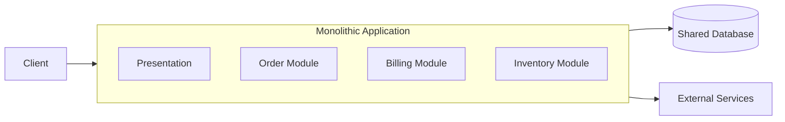

# モノリシックアーキテクチャ

## 概要

モノリシックアーキテクチャは、主要な機能を1つのアプリケーション、1つのデプロイ単位としてまとめる構成です。単純で古い方式という意味ではなく、通信、トランザクション、デバッグ、デプロイを1つのまとまりで扱えるため、初期開発や小さなチームでは非常に有効な選択肢です。

## 解決したい課題

- 分散システムの運用、監視、通信、データ整合性の複雑さを避ける
- 1つのコードベースと1つのデプロイ単位で素早く開発する
- 機能境界がまだ固まっていない段階で、早すぎるサービス分割を避ける
- 単一DBトランザクションで業務処理を扱いやすくする

## 基本構成

| 要素 | 責務 |
| --- | --- |
| Single Application | 画面、API、業務処理、永続化呼び出しを1つのアプリケーションとして実行する |
| Internal Modules | アプリ内部で業務領域や機能ごとに責務を分ける |
| Shared Database | 多くの場合、同じアプリケーションから利用される共通DB |
| Deployment Pipeline | アプリケーション全体をまとめてビルド、テスト、リリースする |

## Mermaid図

この図では、外から見ると1つのアプリケーションとして動き、内部に複数の機能モジュールを持つ構成を示しています。重要なのは、モノリスであっても内部構造を持たなくてよいわけではない、という点です。

## 向いている場面

- 初期プロダクトや小規模から中規模のチーム
- 機能境界や業務領域がまだ変わりやすい
- 単一DBトランザクションで扱いたい処理が多い
- 分散トレーシング、契約テスト、サービス運用の体制がまだない
- リリース頻度やスケール要件が単一アプリで十分

## 向いていない場面

- 複数チームが別々の頻度で独立リリースする必要がある
- 一部機能だけ極端にスケール要件や可用性要件が違う
- ビルド、テスト、デプロイが大きくなりすぎて開発速度を妨げている
- 内部依存が絡まり、変更影響を局所化できない
- 障害がアプリ全体に波及し、隔離が必要になっている

## メリット

- 開発、デバッグ、テスト、デプロイが比較的単純
- プロセス内呼び出しなので通信失敗やネットワーク遅延を考えなくてよい場面が多い
- 単一トランザクションで整合性を保ちやすい
- 全体像を把握しやすく、初期の学習速度が高い

## デメリット

- 規模が大きくなると変更影響が広がりやすい
- 1つの機能変更でも全体リリースになりやすい
- 内部境界を守らないと巨大な密結合になりやすい
- 技術スタックや実行環境を機能ごとに変えにくい

## 類似アーキテクチャとの違い

| 比較対象 | 違い |
| --- | --- |
| モジュラーモノリス | どちらも単一デプロイだが、モジュラーモノリスは内部境界、公開API、依存方向をより明確に管理する |
| マイクロサービスアーキテクチャ | マイクロサービスはサービスごとにデプロイ、DB、運用責任を分ける。モノリスはそれらを1つにまとめる |
| サーバーレスアーキテクチャ | サーバーレスは関数やマネージドサービスを細かく組み合わせる。モノリスはアプリケーション全体を1つの実行単位に寄せる |
| Three-Tier Architecture | Three-TierはPresentation/Application/Dataの層構成。モノリスはデプロイ単位のまとまりを表すため、3層モノリスもあり得る |

## 実務での判断ポイント

- 最初から分散する理由が明確でなければ、モノリスまたはモジュラーモノリスから始める
- モノリスでも、業務領域ごとのパッケージ、モジュール、テーブル所有権を意識する
- 「遅いから分割する」の前に、DB、キャッシュ、クエリ、非同期処理で解けないか確認する
- サービス分割を考える前に、内部モジュール境界で依存を整理する
- 将来分割する可能性がある領域は、内部APIやデータ所有権を早めに明確にする

## 参考

- Martin Fowler, [MonolithFirst](https://martinfowler.com/bliki/MonolithFirst.html)
- Sam Newman, *Monolith to Microservices*, O'Reilly, 2019
- Sam Newman, *Building Microservices*, 2nd Edition, O'Reilly, 2021
